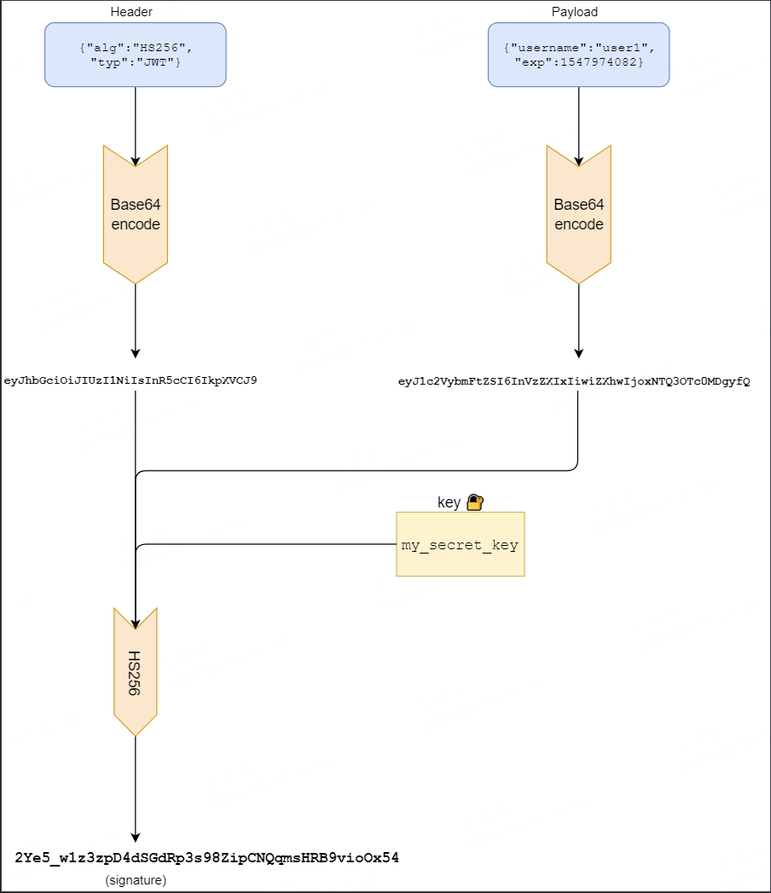

#### 参考链接 
[从零实现 JWT 认证](https://learnku.com/go/t/52399)

#### 访问流程
- 1、客户端传递用户名和密码给服务端
- 2、服务端验证用户名和密码是否正确，
  - 如果正确，生成jwt密钥，并返回给客户端；
  - 如果不正确则返回未认证信息

#### jwt加密流程

#### signin代码编写流程(即jwt创建流程)
- 1、分别创建所需对应变量
  - 创建一个jwt加密时使用的密钥变量
      - 可以使用随机密钥或固定密钥，这里选择简单的固定密钥key
  - 创建固定的用户名密码的map变量 
  - 创建一个结构体变量用来存储用户请求中的用户名、密码
  - 创建生成jwt声明对象claims时所需的结构体变量（即payload部分）
- 2、编写处理函数
  - 首先从用户请求中拿到传递来的账户名、密码
  - 然后验证与服务端的账户名、密码是否匹配
    - 不匹配直接返回401状态码、结束本次访问流程
    - 匹配的话，首先设置下面要生成的token的过期时间，并设置好JWT声明（即payload的内容）
  - 然后调用 jwt.NewWithClaims() 方法生成一个jwt对象，该方法返回jwt加密所需的header、payload、signature三个部分
  - 最后调用 SignedString() 方法对jwt对象进行签名，并返回最终的jwt的token段
  - 将生成的token值返回到客户端的cookie中

- 3、后续经过signin jwt生成token的客户端都可以使用cookie存储用户信息

#### jwt认证流程

#### 

